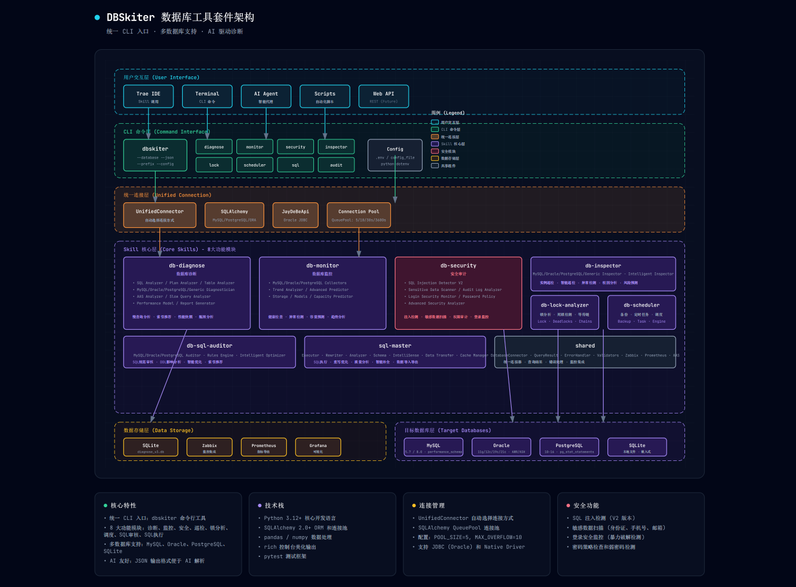

# dbskiter - 数据库AIOps运维助手

<p align="center">
  
</p>

<p align="center">
  <strong>开源免费的数据库运维工具，让AI帮你管理数据库</strong>
</p>

<p align="center">
  <a href="#快速开始">快速开始</a> |
  <a href="#功能特性">功能特性</a> |
  <a href="#使用示例">使用示例</a> |
  <a href="#项目架构">项目架构</a> |
  <a href="#ai集成">AI集成</a>
</p>

---

## 项目简介

**dbskiter** 是一个开源的数据库运维工具集，提供诊断、监控、安全审计、SQL执行等核心功能。

### 适用场景

- 中小企业没有专职DBA
- 需要快速诊断数据库问题
- 定期安全审计和巡检
- AI辅助的数据库管理

### 支持数据库

| 数据库 | 状态 | 说明 |
|--------|------|------|
| MySQL | 完全支持 | 主推荐，功能最完善 |
| Oracle | 支持 | 11g/12c/19c+ |
| PostgreSQL | 部分支持 | 基础功能可用 |
| SQL Server | 计划中 | 未来版本支持 |

---

## 快速开始

### 1. 安装

```bash
# 克隆仓库
git clone https://github.com/magicCzc/dbskiter.git
cd dbskiter

# 安装依赖
pip install -e .
```

### 2. 配置环境变量

创建 `.env` 文件（**切勿提交到Git仓库**）：

```bash
# 复制示例配置
cp .env.example .env

# 编辑 .env 文件，填入你的数据库配置
```

**最小配置示例（单数据库）**：

```bash
# MySQL配置
DB_HOST=localhost
DB_PORT=3306
DB_USER=root
DB_PASSWORD=your_password
DB_NAME=your_database
```

**多实例配置示例（推荐）**：

```bash
# MySQL - 示例库1（示例配置，请替换为实际值）
DB_JUMP_HOST=your_mysql_host
DB_JUMP_PORT=3306
DB_JUMP_USER=your_username
DB_JUMP_PASSWORD=your_password
DB_JUMP_NAME=your_database
DB_JUMP_DIALECT=mysql+pymysql

# MySQL - 示例库2（示例配置，请替换为实际值）
DB_CHENZC_HOST=your_mysql_host
DB_CHENZC_PORT=3306
DB_CHENZC_USER=your_username
DB_CHENZC_PASSWORD=your_password
DB_CHENZC_NAME=your_database
DB_CHENZC_DIALECT=mysql+pymysql

# Oracle - 示例库（示例配置，请替换为实际值）
DB_ORCL_HOST=your_oracle_host
DB_ORCL_PORT=1521
DB_ORCL_USER=your_username
DB_ORCL_PASSWORD=your_password
DB_ORCL_SERVICE=orcl
DB_ORCL_DIALECT=oracle+jdbc
```

**使用别名连接**：

```bash
# 使用别名连接指定数据库
dbskiter --database=jump sql execute "SELECT 1"
dbskiter --database=orcl sql execute "SELECT 1 FROM DUAL"
```

### 3. 验证安装

```bash
# 查看帮助
dbskiter --help

# 测试连接（使用默认配置或指定数据库）
dbskiter monitor health
dbskiter --database=jump monitor health
```

---

## 功能特性

### 1. 数据库诊断 (db-diagnose)

SQL诊断、慢查询分析、索引推荐、性能报告。

```bash
# 诊断慢查询
dbskiter --database=<数据库名> diagnose slow-queries --limit=10

# 诊断特定SQL
dbskiter --database=<数据库名> diagnose sql "SELECT * FROM users WHERE email='test@example.com'"

# 推荐索引
dbskiter --database=<数据库名> diagnose recommend-indexes --table=orders

# 生成综合报告
dbskiter --database=<数据库名> diagnose report
```

### 2. 健康监控 (db-monitor)

健康检查、异常检测、容量预测、趋势分析。

```bash
# 健康检查
dbskiter --database=<数据库名> monitor health

# 异常检测
dbskiter --database=<数据库名> monitor anomalies

# 容量预测（磁盘）
dbskiter --database=<数据库名> monitor capacity --resource=disk --days=30

# 查看历史趋势
dbskiter --database=<数据库名> monitor history cpu_usage
```

### 3. 安全审计 (db-security)

SQL注入检测、敏感数据扫描、权限审计、密码策略检查。

```bash
# 完整安全审计
dbskiter --database=<数据库名> security audit

# SQL注入检测
dbskiter --database=<数据库名> security sql-injection "SELECT * FROM users WHERE id=%s"

# 敏感数据扫描
dbskiter --database=<数据库名> security sensitive-data

# 检查密码策略
dbskiter --database=<数据库名> security password-policy
```

### 4. SQL执行 (sql-master)

智能SQL执行、数据导入导出、SQL审核。

```bash
# 执行SQL
dbskiter --database=<数据库名> sql execute "SELECT COUNT(*) FROM users"

# 导出数据
dbskiter --database=<数据库名> sql export --table=users --output=users.csv

# SQL审核
dbskiter --database=<数据库名> sql audit "SELECT * FROM orders"
```

### 5. 锁分析 (db-lock-analyzer)

锁分析、死锁检测、锁等待链追踪。

```bash
# 分析当前锁
dbskiter --database=<数据库名> lock analyze

# 检测死锁
dbskiter --database=<数据库名> lock deadlocks

# 查看锁等待链
dbskiter --database=<数据库名> lock chains
```

### 6. 智能巡检 (db-inspector)

配置检查、性能检查、安全检查、根因分析。

```bash
# 执行巡检
dbskiter --database=<数据库名> inspector run

# 生成报告
dbskiter --database=<数据库名> inspector report --output=report.html

# 智能巡检
dbskiter --database=<数据库名> inspector intelligent
```

---

## � 使用示例

### 场景1：数据库变慢了

```bash
# 1. 快速健康检查
dbskiter --database=<数据库名> monitor health

# 2. 查看慢查询
dbskiter --database=<数据库名> diagnose slow-queries --limit=5

# 3. 分析锁情况
dbskiter --database=<数据库名> lock analyze

# 4. 获取优化建议
dbskiter --database=<数据库名> diagnose recommend-indexes
```

### 场景2：日常安全巡检

```bash
# 1. 安全审计
dbskiter --database=<数据库名> security audit

# 2. 检查弱密码
dbskiter --database=<数据库名> security weak-passwords

# 3. 扫描敏感数据
dbskiter --database=<数据库名> security sensitive-data

# 4. 生成巡检报告
dbskiter --database=<数据库名> inspector report
```

### 场景3：容量规划

```bash
# 1. 磁盘容量预测
dbskiter --database=<数据库名> monitor capacity --resource=disk --days=90

# 2. 连接数趋势
dbskiter --database=<数据库名> monitor trend --metric=connections

# 3. 查看历史数据
dbskiter --database=<数据库名> monitor history table_size
```

---

## 项目架构

```
dbskiter/
├── cli/                          # CLI命令入口
│   ├── commands/                 # 各模块命令实现
│   │   ├── diagnose.py          # 诊断命令
│   │   ├── monitor.py           # 监控命令
│   │   ├── security.py          # 安全命令
│   │   ├── sql.py               # SQL命令
│   │   ├── lock.py              # 锁分析命令
│   │   └── inspector.py         # 巡检命令
│   ├── main.py                  # CLI主入口
│   └── config.py                # 配置管理
│
├── db_diagnose/                  # 诊断模块
│   ├── skill.py                 # 诊断Skill主类
│   ├── engine.py                # 诊断引擎
│   └── analyzers/               # 各类分析器
│
├── db_monitor/                   # 监控模块
│   ├── skill.py                 # 监控Skill主类
│   ├── collector.py             # 指标采集器
│   ├── storage.py               # 数据存储
│   └── models.py                # 数据模型
│
├── db_security/                  # 安全模块
│   ├── skill.py                 # 安全Skill主类
│   ├── advanced_security_analyzer.py
│   ├── sensitive_data_scanner_v2.py
│   └── password_policy_checker.py
│
├── db_scheduler/                 # 调度模块
│   ├── skill.py                 # 调度Skill主类
│   ├── connection_pool.py       # 连接池管理
│   └── persistent_storage.py    # 持久化存储
│
├── db_inspector/                 # 巡检模块
│   ├── skill.py                 # 巡检Skill主类
│   └── intelligent_inspector.py # 智能巡检
│
├── db_lock_analyzer/             # 锁分析模块
│   └── skill.py                 # 锁分析Skill主类
│
├── sql_master/                   # SQL执行模块
│   ├── skill.py                 # SQL Skill主类
│   ├── executor.py              # SQL执行器
│   └── data_transfer.py         # 数据传输
│
└── shared/                       # 共享组件
    ├── database_connector.py    # 数据库连接器
    ├── unified_connector.py     # 统一连接器
    ├── zabbix_client.py         # Zabbix客户端
    ├── prometheus_client.py     # Prometheus客户端
    └── mysql_aas_calculator_v2.py # AAS计算器
```

---

## AI集成

dbskiter 支持 AI IDE（如 Trae、Cursor）集成，通过 Skill 文档让 AI 学会使用工具。

### 配置方法

```bash
# Trae IDE
cp -r .trae/skills/* ~/.trae/skills/

# Cursor IDE
cp -r .trae/skills/* .cursor/skills/
```

### AI使用示例

**用户**：帮我检查数据库健康状态

**AI**（自动读取 Skill 文档）：
```bash
# 执行健康检查
dbskiter --database=<数据库名> monitor health --json

# 解析结果
健康评分：85/100
状态：健康
连接数：45/100 (45%)
CPU使用率：35%
建议：系统运行良好，无需处理
```

---

## 高级配置

### 多数据库配置

```bash
# 使用别名连接指定数据库（推荐方式）
dbskiter --database=jump monitor health
dbskiter --database=orcl monitor health

# 或使用前缀方式（向后兼容）
dbskiter --prefix=ORACLE monitor health
dbskiter --prefix=MYSQL2 monitor health
```

### JSON输出

```bash
# 便于程序解析
dbskiter --database=<数据库名> --json monitor health
```

### 配合Prometheus

```bash
# 导出Prometheus格式指标
dbskiter --database=<数据库名> monitor collect
```

---

## 重要说明

### 定位说明

dbskiter 是**诊断工具**，不是实时监控系统。

| 场景 | 推荐方案 |
|------|----------|
| 实时监控 | Prometheus + Grafana |
| 告警通知 | Alertmanager |
| 故障诊断 | **dbskiter** |
| SQL优化 | **dbskiter** |
| 安全审计 | **dbskiter** |

### 定时任务示例

```bash
# 每小时健康检查（使用默认配置）
0 * * * * dbskiter monitor health --json > /var/log/db-health.json

# 每天安全审计（指定数据库）
0 2 * * * dbskiter --database=jump security audit > /var/log/db-security-audit.log
```

---

## 文档

- [CLI命令参考](docs/CLI_COMMAND_REFERENCE.md)
- [架构设计文档](docs/ARCHITECTURE.md)
- [Skill开发指南](docs/SKILL_DEVELOPMENT.md)

---

## 开发

```bash
# 安装开发依赖
pip install -e ".[dev]"

# 代码格式化
black dbskiter/

# 类型检查
mypy dbskiter/
```

---

## License

MIT License

---

<p align="center">
  <strong>让每个人都能轻松管理数据库</strong>
</p>
